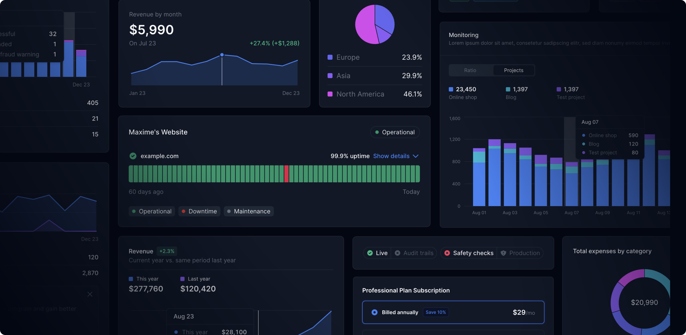

 
 

  <a href="https://tremor.so/raw"> 
    <picture>
       <source media="(prefers-color-scheme: dark)" srcset="public/images/tremor-logo-dark.svg">
      <source media="(prefers-color-scheme: light)" srcset="public/images/tremor-logo-light.svg">
    
    </picture>
  </a>

 
 

 <h1>Copy & Paste React components to build modern web applications</h1>

[Tremor](https://tremor.so/) offers 35+ customizable, accessible React components to build dashboards and modern web applications. Built on top of Tailwind CSS and Radix UI.

 

 

## Getting Started

See our [Installation Guide](https://tremor.so/docs/getting-started/installation) to get started.

## Socials

- [Tremor Website](https://tremor.so)
- [Tremor on X (formerly Twitter)](https://twitter.com/tremorlabs)
- [Tremor on Slack](https://tremor.so/slack)

## Community and Contribution

We are always looking for new ideas or other ways to improve Tremor Raw. If you have developed anything cool or found a bug, send us a pull request. Check out our Contributor License Agreement [here](https://www.tremor.so/contributors).

## License

[Apache License 2.0](https://github.com/tremorlabs/tremor/blob/main/License)

Copyright &copy; 2024 Tremor. All rights reserved.
